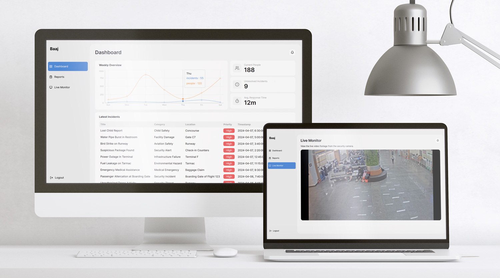
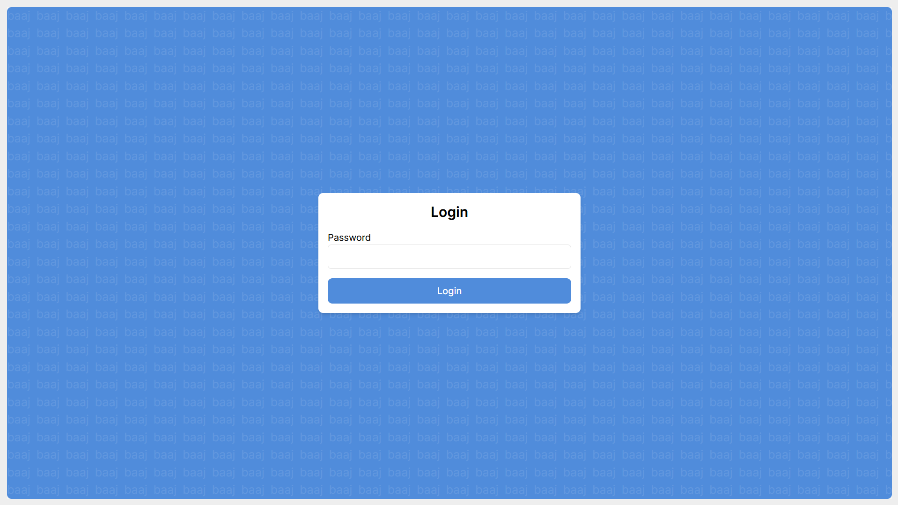
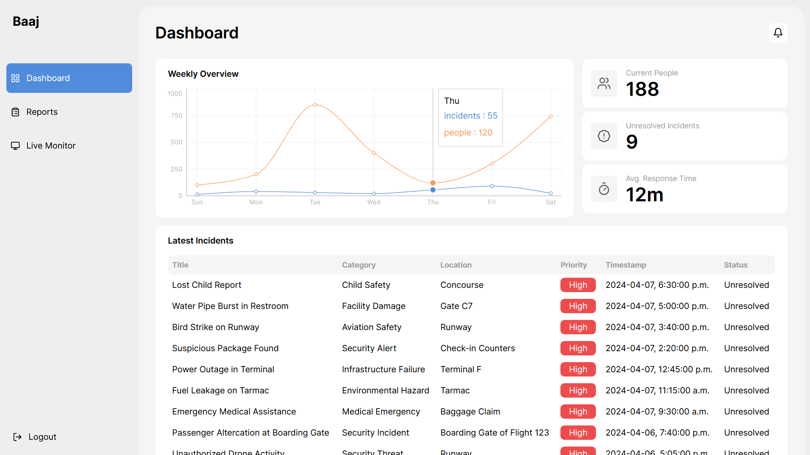
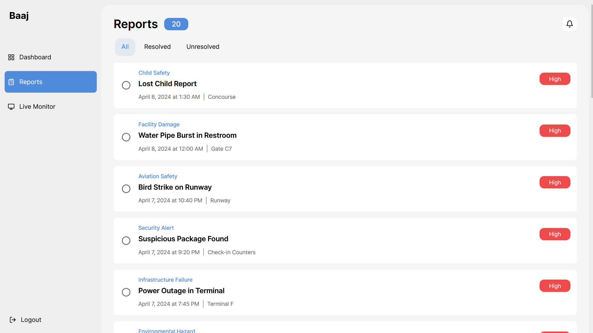
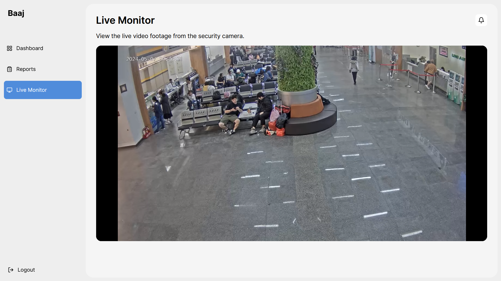

# YVR Crows Nest (Baaj)

An AI-powered vision system designed to enhance passenger experience and optimize operational efficiency at the YVR airport by utilizing machine learning to track passenger volumes and identify maintenance needs in real-time using security cameras.

An AI-powered airport maintenance monitoring application designed to enhance passenger experience and optimize operational efficiency at YVR Airport. By leveraging machine learning algorithms, the application tracks passenger volumes, identifies maintenance needs such as lost baggage, and automates incident reporting for various airport incidents such as spills and lost items. This system connects to YVR Airport's Bosch security cameras and uses advanced visual detection technologies like YOLOv8, TensorFlow Lite, and Google Coral Edge TPU to process real-time video feeds, making it a crucial tool for maintaining airport safety and efficiency.

> [!IMPORTANT]
> Please note that the final version of this application requires a Google Coral Edge TPU and integration with Bosch Cameras to run for the best performance.

## Table of Contents

* [Screenshots](#screenshots)
* [Acknowledgements](#acknowledgements)
* [Technologies](#technologies)
* [Features](#features)
  * [AI-Powered Maintenance System](#ai-powered-maintenance-system)
  * [Passenger Volumne Tracking System](#passenger-volume-tracking-system)
  * [Bosch Security Camera Integration](#bosch-security-camera-integration)
* [Awards](#awards)

## Screenshots

|  |  |
|:--:|:--:|
| _Login Page_ | _Dashboard Page_ |
|  |  |
| _Reports Page_ | _Live Monitor Page_ |

## Acknowledgements

* Towa Quimbayo [GitHub](https://github.com/towaquimbayo) [LinkedIn](https://www.linkedin.com/in/towa-quimbayo/)
* Mangat Toor [GitHub](https://github.com/immangat) [LinkedIn](https://www.linkedin.com/in/immangat)
* Noufil Saqib [GitHub](https://github.com/noufilsaqib) [LinkedIn](https://www.linkedin.com/in/muhammad-noufil-saqib/)
* Bhavnoor Saroya [GitHub](https://github.com/BhavnoorSaroya) [LinkedIn](https://www.linkedin.com/in/bhavnoor-saroya)
* Abhishek Chouhan [GitHub](https://github.com/abhishekchouhannk) [LinkedIn](https://www.linkedin.com/in/abhishekchouhannk)
* Ranveer Rai [GitHub](https://github.com/Ranveerai03) [LinkedIn](http://www.linkedin.com/in/ranveer-rai)
* Gurnoor Tatla [LinkedIn](https://www.linkedin.com/in/gurnoortatla/)

## Technologies

* Raspberry Pi
* Bosch Security Camera
* Google Coral Edge TPU
* React.js `v18.2.0`
* React-Helmet `v6.1.0`
* React-Redux `v9.1.0`
* Recharts `v2.12.4`
* Redux `v5.0.1`
* Redux-Thunk `v3.1.0`
* TailwindCSS `v3.4.3`
* Node.js
* Python
* Blinker `v1.7.0`
* ContourPy `v1.2.1`
* Cython `v3.0.10`
* Flask `v3.0.3`
* Flask SQLAlchemy `v3.1.1`
* Greenlet `v3.0.3`
* Kiwisolver `v1.4.5`
* Matplotlib `v3.8.4`
* MySQL `v0.0.3`
* NetworkX `v3.3.0`
* Numpy `v1.26.4`
* OpenCV `v4.9.0.80`
* Pandas `v2.2.1`
* Pillow `v10.3.0`
* Psutil `v5.9.8`
* Scipy `v1.13.0`
* Seaborn `v0.13.2`
* Shapely `v2.0.3`
* TensorFlow Lite
* THOP (PyTorch) `v0.1.1`
* Torch `v2.2.2`
* TorchVision `v0.17.2`
* Ultralytics YOLOv8 `v8.1.45`

## Features

### AI-Powered Maintenance System

Efficiently detect and monitor maintenance issues and incidents within the airport premises, ensuring timely intervention and upkeep.

* __Automated Incident Detection__: Utilizes real-time Bosch security camera feeds to detect and capture incidents such as spills, lost baggage, and other hazards. The system automatically generates incident reports and notifies the airport's premise and security team.
* __Incident Reporting__: Automatically creates incident issue reports from detected incidents, reducing the need for manual monitoring and allowing for immediate response to hazards.
* __Advanced Image Recognition Algorithm__: Employs YOLOv8, TensorFlow Lite, and Google Coral Edge TPU for accurate and efficient visual detection to identify spills or hazards on the airport floors, enhancing safety protocols.

### Passenger Volume Tracking System

Monitor and manage passenger flow through the airport.

* __Real-Time Analytics__: Provides an intuitive interface to track passenger volumes throughout the airport in real-time, offering valuable insights for operational management and resource allocation.
* __Overflow Detection__: Alerts airport staff when passenger volumes exceed certain thresholds, ensuring timely intervention to maintain smooth operations.

### Bosch Security Camera Integration

Seamlessly connect with existing YVR Aiport security infrastructure.

* __Live Camera Feeds__: Integrates with ceiling-mounted Bosch security cameras via HDMI cables to capture footage and train predictive models.
* __Visual Detection__: Uses live camera feeds for real-time surveillance and analysis, offering optimal coverage and perspective for incident detection.

## Awards

YVR Crows Nest (Baaj), team ORA has received significant recognition for its innovative approach to streamlining maintenance workflows using AI-driven analytics. At the YVR Hackathon, we were honoured with the following awards:

* :trophy:__1st Place__: Our pioneering approach impressed the judges for its practicality and potential impact, earning us a $5,000 prize. The YVR Hackathon was designed to address real-world challenges within the airport environment, aimed at redefining the future of airport operations and maintenance.

The event attracted over 138 participants from colleges across the Lower Mainland. A panel of judges, comprising industry experts and academic leaders, evaluated the presentations based on innovation, practicality, and scalability. YVR plans to implement some of the top solutions developed during the Hackathon.

For more information, you can read the full article on the following blog [here](https://commons.bcit.ca/news/2024/05/yvr-hackathon-2024/).

> The solutions presented by the students during the hackathon demonstrated to YVR Maintenance that there is an abundance of local talent capable of developing practical solutions using machine learning in a remarkably short time frame. The final submissions will significantly contribute to the development of our Facility Machine Learning Enablement program for 2024. Elements will also be directly implemented or further developed by both student projects for implementation onsite. Events like these reaffirm Maintenance and Innovation teams’ dedication to fostering innovation and community collaboration.

_— Aran McAteer, Director, Maintenance and Facilities Optimization, Vancouver Airport Authority._
